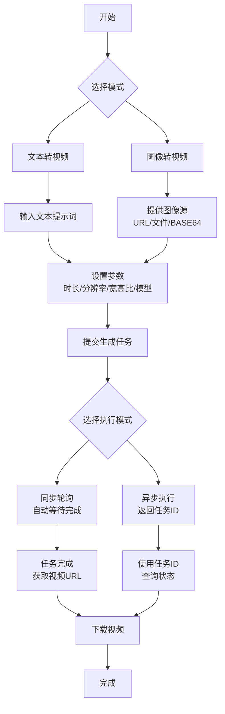

# Seedance Video Generation Skill

[](https://github.com/zBlackIf/seedance-video-generation-skill)
[](https://www.python.org/)
[](LICENSE)

一个专业的视频生成工具，使用火山引擎（Volcengine）的Seedance API，支持文本转视频和图像转视频生成。为AI助手、开发者和内容创作者提供简单易用的命令行接口。

## ✨ 核心功能

- **文本转视频**：根据文字描述生成高质量视频
- **图像转视频**：基于参考图像生成动态视频
- **多模型支持**：Seedance 1.5 Pro、1.0 Pro、Lite版本
- **灵活参数**：自定义时长、分辨率、宽高比、种子等
- **异步处理**：支持轮询模式或异步任务ID获取
- **智能配置**：环境变量与配置文件双重支持

## 🚀 快速开始

### 1. 克隆仓库
```bash
git clone https://github.com/zBlackIf/seedance-video-generation-skill.git
cd seedance-video-generation-skill
```

### 2. 安装依赖
```bash
pip install 'volcengine-python-sdk[ark]'
```

### 3. 配置API密钥
```bash
# 复制配置模板
mkdir -p ~/.config/seedance
cp config/seedance.json.example ~/.config/seedance/config.json

# 编辑配置文件，填入您的API密钥
# 编辑器如：nano、vim或vscode
nano ~/.config/seedance/config.json
```

### 4. 运行第一个视频生成
```bash
# 文本转视频
python scripts/seedance.py text-to-video --text "一只可爱的小猫在草地上玩耍" --duration 5 --resolution 720p

# 图像转视频
python scripts/seedance.py image-to-video --image "/path/to/your/image.jpg" --duration 6
```

## 📦 详细安装指南

### 系统要求
- Python 3.7 或更高版本
- pip 包管理器
- 有效的火山引擎API密钥

### 安装步骤
```bash
# 1. 克隆代码库
git clone https://github.com/zBlackIf/seedance-video-generation-skill.git
cd seedance-video-generation-skill

# 2. 创建虚拟环境（推荐）
python -m venv venv
source venv/bin/activate  # Linux/macOS
# 或 Windows: venv\Scripts\activate

# 3. 安装必要的Python包
pip install 'volcengine-python-sdk[ark]'
```

## 🔧 配置管理

### 配置方式（按优先级）

#### 1. 配置文件（推荐）
创建 `~/.config/seedance/config.json`：
```json
{
  "default": {
    "ark_api_key": "your-api-key-here",
    "region": "cn-beijing",
    "base_url": "https://ark.cn-beijing.volces.com/api/v3",
    "timeout": 300,
    "poll_interval": 5
  },
  "development": {
    "ark_api_key": "dev-api-key-here"
  },
  "production": {
    "ark_api_key": "prod-api-key-here"
  }
}
```

#### 2. 环境变量
```bash
export ARK_API_KEY="your-api-key-here"
export SEEDANCE_REGION="cn-beijing"
export SEEDANCE_TIMEOUT=300
export SEEDANCE_POLL_INTERVAL=5
```

#### 3. 命令行参数
```bash
python scripts/seedance.py text-to-video --text "prompt" --environment development
```

### 配置验证
```bash
# 验证配置是否正确加载
python -c "from scripts.config import Config; c = Config(); print('配置有效') if c.validate()[0] else print('错误:', c.validate()[1])"
```

## 📖 使用教程

### 文本转视频
```bash
# 基础用法（5秒，720p）
python scripts/seedance.py text-to-video --text "夕阳下的海滩，海浪轻轻拍打岸边"

# 指定模型和参数
python scripts/seedance.py text-to-video \
  --text "未来城市中的飞行汽车" \
  --model doubao-seedance-1-5-pro-251215 \
  --duration 8 \
  --resolution 1080p \
  --ratio 16:9 \
  --seed 12345

# 异步模式（立即返回任务ID）
python scripts/seedance.py text-to-video \
  --text "繁忙的东京街头夜景" \
  --async

# 启用草稿模式（降低成本）
python scripts/seedance.py text-to-video \
  --text "测试场景" \
  --draft
```

### 图像转视频
```bash
# 从本地文件生成
python scripts/seedance.py image-to-video \
  --image "/path/to/photo.jpg" \
  --duration 6

# 带文字引导
python scripts/seedance.py image-to-video \
  --image "/path/to/portrait.jpg" \
  --text "一个人在公园里微笑散步"

# 使用URL
python scripts/seedance.py image-to-video \
  --image "https://example.com/image.png" \
  --duration 5

# Base64格式
python scripts/seedance.py image-to-video \
  --image "data:image/jpeg;base64,/9j/4AAQSkZJRgABAQAAAQABAAD..." \
  --duration 5
```

### 查询任务状态
```bash
# 查询任务状态
python scripts/seedance.py query --task-id cgt-20250331175019-68d9t

# 持续跟踪直到完成
python scripts/seedance.py query \
  --task-id cgt-20250331175019-68d9t \
  --follow
```

## 🔍 参数详解

### 通用参数
| 参数 | 类型 | 默认值 | 描述 |
|------|------|--------|------|
| `--model` | string | `doubao-seedance-1-5-pro-251215` | 模型ID |
| `--duration` | int | 5 | 视频时长（2-12秒） |
| `--resolution` | string | 720p | 分辨率：`480p`、`720p`、`1080p` |
| `--ratio` | string | adaptive | 宽高比：`16:9`、`4:3`、`1:1`、`3:4`、`9:16`、`21:9`、`adaptive` |
| `--seed` | int | -1 | 随机种子（-1为随机） |
| `--watermark` | flag | false | 添加水印 |
| `--draft` | flag | false | 启用草稿模式（1.5 Pro） |
| `--generate-audio` | boolean | true | 生成音频（1.5 Pro） |
| `--return-last-frame` | flag | false | 返回最后一帧图像 |
| `--service-tier` | string | default | 服务等级：`default`（在线）、`flex`（离线，50%成本） |
| `--callback-url` | string | - | 回调URL |
| `--async` | flag | false | 异步模式 |

### 环境特定参数
| 参数 | 描述 | 示例 |
|------|------|------|
| `-e, --environment` | 配置环境 | `default`、`development`、`production` |
| `-v, --verbose` | 详细输出模式 | - |
| `--timeout` | 轮询超时（秒） | 300 |
| `--poll-interval` | 轮询间隔（秒） | 5 |

## 🏗️ 支持的模型

| 模型ID | 类型 | 功能 |
|--------|------|------|
| `doubao-seedance-1-5-pro-251215` | 专业版 | 文本/图像转视频、音频生成、草稿模式、自适应宽高比 |
| `doubao-seedance-1-0-pro-251215` | 专业版 | 文本/图像转视频（首尾帧） |
| `doubao-seedance-1-0-lite-t2v-251215` | 轻量版 | 文本转视频 |
| `doubao-seedance-1-0-lite-i2v-251215` | 轻量版 | 图像转视频（参考图像1-4） |

### 推荐选择
- **最佳效果**：Seedance 1.5 Pro（推荐）
- **标准需求**：Seedance 1.0 Pro
- **轻量使用**：Lite版本

## 🔄 工作流程



## 🛠️ 项目结构

```
seedance-video-generation-skill/
├── README.md                 # 本文档
├── SKILL.md                  # 技能核心文档
├── scripts/                  # 可执行脚本
│   ├── seedance.py           # 主程序
│   └── config.py             # 配置管理
├── config/                   # 配置文件
│   ├── seedance.json         # 实际配置文件
│   └── seedance.json.example # 配置模板
├── references/               # 参考资料
│   └── api_reference.md      # API完整参考
└── .gitignore               # Git忽略规则
```

## 🤔 常见问题

### 如何获取API密钥？
1. 访问 [火山引擎方舟平台](https://console.volcengine.com/ark/region:ark+cn-beijing/apiKey)
2. 登录您的账号
3. 点击 **创建 API Key** 按钮
4. 复制生成的API密钥

### 任务长时间不完成怎么办？
```bash
# 使用异步模式，稍后查询
python scripts/seedance.py text-to-video --text "prompt" --async

# 记录返回的任务ID
# 稍后查询状态
python scripts/seedance.py query --task-id <task-id> --follow
```

### 支持哪些图像格式？
- **常见格式**：JPEG、PNG、WEBP、BMP、TIFF、GIF
- **高级格式**：HEIC、HEIF（仅1.5 Pro）

### 视频文件有效期？
生成的视频URL有效期为 **24小时**，请及时下载。

### 任务ID有效期？
任务记录保留 **7天**。

## 🐛 故障排除

### "ARK_API_KEY not configured"
**原因**：未配置API密钥
**解决方案**：
```bash
# 方法1：设置环境变量
export ARK_API_KEY="your-api-key"

# 方法2：创建配置文件
mkdir -p ~/.config/seedance
cp config/seedance.json.example ~/.config/seedance/config.json
# 编辑文件填入API密钥
```

### "volcengine-python-sdk is not installed"
**原因**：缺少SDK依赖
**解决方案**：
```bash
pip install 'volcengine-python-sdk[ark]'
```

### "Invalid image input"
**原因**：图像格式不支持或路径错误
**解决方案**：
- 确认图像路径正确
- 检查图像格式是否支持
- 验证图像大小<30MB，尺寸300-6000像素

### "Task timeout"
**原因**：任务超时
**解决方案**：
```bash
# 增加超时时间
python scripts/seedance.py text-to-video --text "prompt" --timeout 600
# 或使用异步模式
python scripts/seedance.py text-to-video --text "prompt" --async
```

## 📊 性能建议

1. **批量处理**：使用异步模式处理多个任务
2. **分辨率选择**：根据需求选择合适分辨率
3. **草稿模式**：测试时使用草稿模式降低成本
4. **超时设置**：长视频适当增加超时时间
5. **缓存策略**：保存任务ID以便后续查询

## 📈 实际应用场景

### 内容创作
```bash
# 生成社交媒体视频
python scripts/seedance.py text-to-video \
  --text "清晨阳光下的咖啡杯，热气袅袅升起" \
  --duration 7 \
  --ratio 9:16
```

### 产品演示
```bash
# 基于产品图片生成演示视频
python scripts/seedance.py image-to-video \
  --image "product-shot.jpg" \
  --text "智能手表展示各项功能" \
  --duration 8
```

### 教育材料
```bash
# 生成教学动画
python scripts/seedance.py text-to-video \
  --text "太阳系行星围绕太阳公转" \
  --duration 10 \
  --resolution 1080p
```

## 🔗 相关资源

- [火山引擎官方文档](https://www.volcengine.com/docs/82379/1366799)
- [Volcengine Python SDK](https://github.com/volcengine/volcengine-python-sdk)
- [Seedance API 参考](references/api_reference.md)

## 🤝 贡献指南

欢迎提交Issue和Pull Request！

1. Fork 本仓库
2. 创建特性分支 (`git checkout -b feature/AmazingFeature`)
3. 提交更改 (`git commit -m 'Add some AmazingFeature'`)
4. 推送分支 (`git push origin feature/AmazingFeature`)
5. 开启 Pull Request

## 📄 许可证

本项目基于 MIT 许可证 - 查看 [LICENSE](LICENSE) 文件了解详情。

## 👤 作者

- **GitHub**: [@zBlackIf](https://github.com/zBlackIf)
- **仓库**: [seedance-video-generation-skill](https://github.com/zBlackIf/seedance-video-generation-skill)

## ⭐ 支持项目

如果这个项目对您有帮助，请给个 ⭐ Star！

---

**提示**：使用前请确保已获取有效的火山引擎API密钥，并注意视频生成的使用配额和费用。

